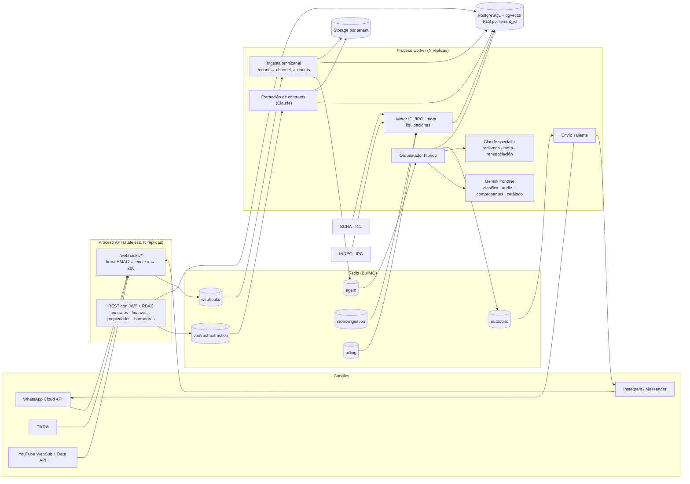
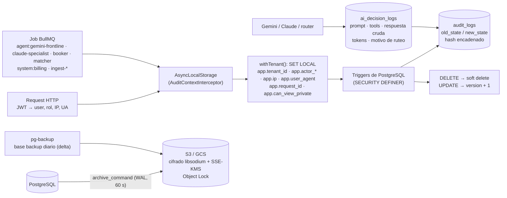
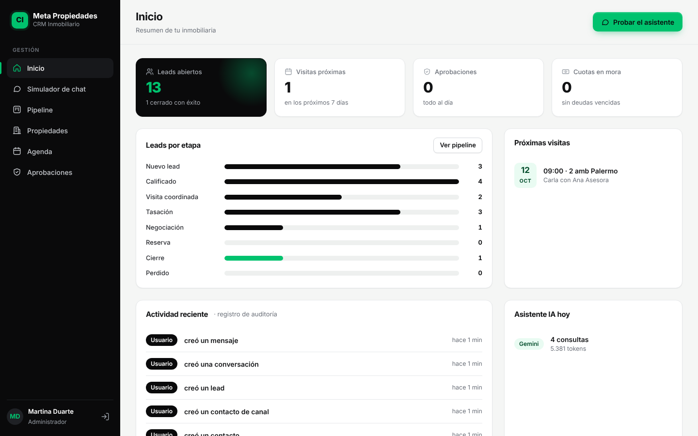
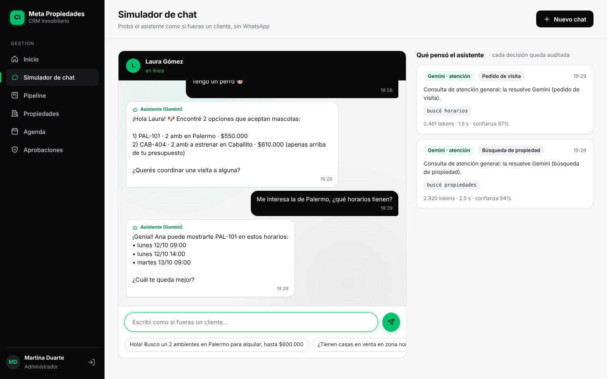
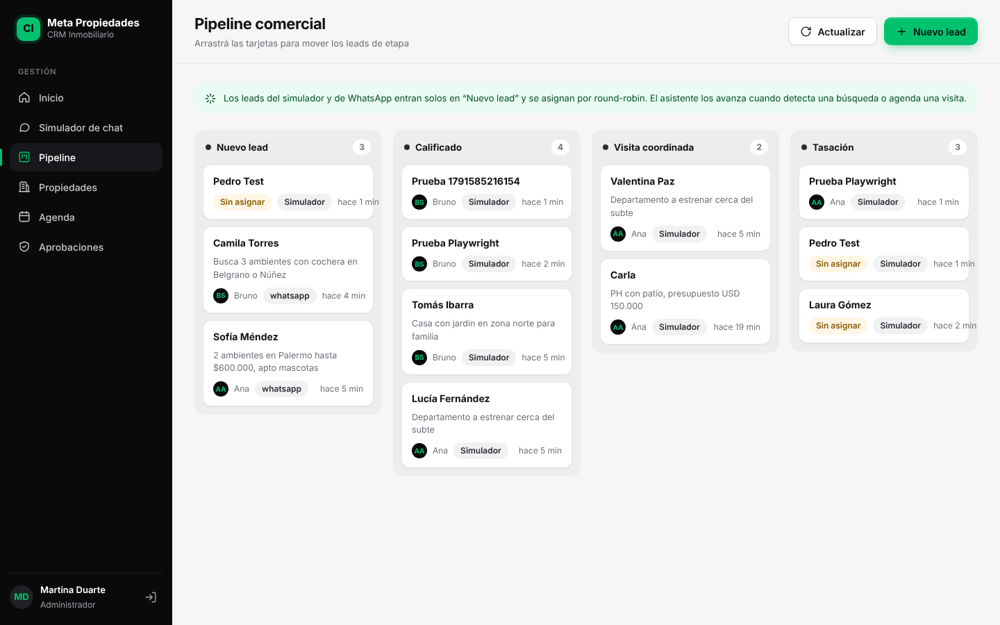
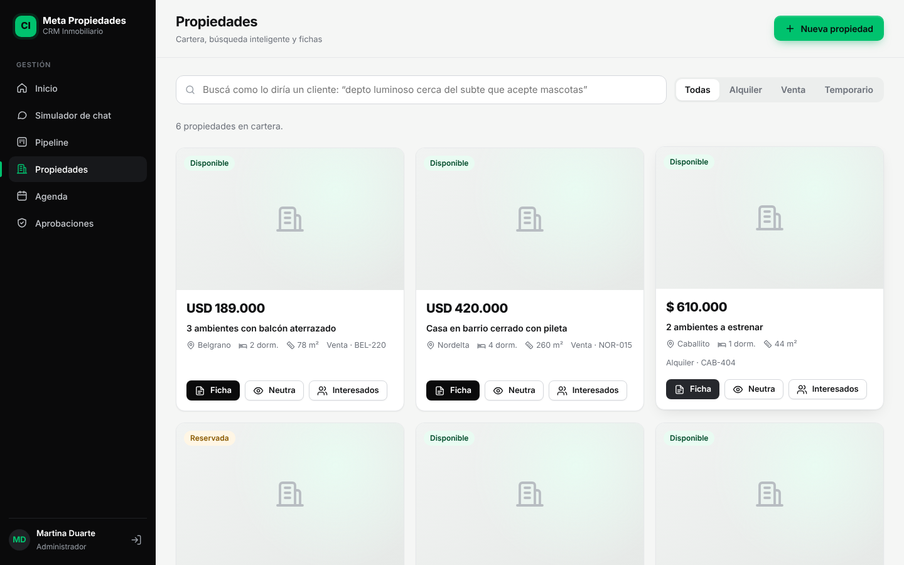

# CRM Inmobiliario SaaS (multi-tenant · Argentina)

CRM vertical para inmobiliarias: administración de alquileres con actualización **ICL / IPC**, lectura de contratos con **Claude**, bandeja **omnicanal** (WhatsApp, Instagram, Messenger, TikTok, YouTube) y un **agente híbrido** con Gemini en la primera línea de atención y Claude como especialista legal-contractual.

Stack: NestJS 12 (ESM) · TypeScript · PostgreSQL 17 + pgvector + RLS · Drizzle ORM · Redis + BullMQ · `@anthropic-ai/sdk` · `@google/genai`.

---

## 1. Arquitectura



### Flujo de un mensaje entrante

1. **API** recibe el webhook, valida `X-Hub-Signature-256` (o `TikTok-Signature`) sobre el *raw body*, encola con `jobId = sha256(body)` y responde **200 en ~25 ms**. Los reintentos de la plataforma con el mismo cuerpo se descartan en Redis.
2. **Worker `webhooks`**: normaliza el payload, resuelve el tenant por `channel_accounts` (`phone_number_id`, `page_id`, …), unifica el contacto (identidad por canal + teléfono), guarda el mensaje (idempotente por `external_id`) y descarga la media al storage del tenant.
3. Encola un turno del agente con **debounce de 4 s** por conversación (las ráfagas de mensajes se responden juntas) y lock distribuido por conversación.
4. **Orquestador**: Gemini transcribe audios / lee comprobantes → Gemini clasifica la intención → el **router** decide:
   - `gemini`: respuesta con *function calling* (`search_properties` sobre pgvector, `get_account_status`, `request_visit`).
   - `claude`: reclamos, disputas, mora o renegociación. Claude analiza contrato + cronograma + historial de ajustes y devuelve una decisión estructurada; los avisos formales y las respuestas de riesgo quedan como **borradores pendientes de aprobación humana** (`/agent-drafts`).
   - `human`: el contacto pidió una persona → `human_takeover`, los agentes dejan de responder.
5. La respuesta sale por la cola `outbound` (respeta la ventana de 24 h de WhatsApp) y se actualiza la memoria del contacto.

### Decisiones clave

| Tema | Decisión |
|---|---|
| Aislamiento | `tenant_id` en todas las tablas transaccionales + **RLS forzada** (`FORCE ROW LEVEL SECURITY`). La API usa el rol `crm_app` y fija `SET LOCAL app.tenant_id` por transacción; sin contexto no ve ninguna fila. El `tenantId` sale siempre del JWT. |
| Roles de BD | `crm_owner` (migraciones) · `crm_app` (API, sujeto a RLS) · `crm_system` (`BYPASSRLS`, solo workers, ruteo de webhooks y login). |
| Secretos por tenant | AES-256-GCM con el `tenant_id` como AAD; un ciphertext copiado a otro tenant no descifra. |
| Cron | BullMQ **Job Schedulers** en Redis: con N réplicas de worker cada disparo corre una sola vez. |
| Dinero | `numeric(14,2)` + `decimal.js`; los cánones se calculan siempre desde el canon base (sin acumular redondeo). |
| IA con riesgo legal | Claude nunca envía avisos formales por su cuenta; los comprobantes nunca marcan una cuota como `paid`: la dejan `under_review`. |
| Router | Clasificador (Gemini) + red de seguridad por regex (carta documento, desalojo, rescisión…) + sentimiento hostil. |

---

## 2. Modelo de datos

Esquema completo en [`src/database/schema.ts`](src/database/schema.ts). Migraciones en [`drizzle/`](drizzle/): `0000` tablas base, `0001` RLS, `0002` tablas Tokko/auditoría, **`0003` triggers zero-trust** (auditoría encadenada, soft delete, versionado, capa privada, pipeline por defecto, anti doble reserva), `0004` limpieza del modelo anterior, `0005` retención del log de IA y `0006`–`0008` agenda propia (bloqueos y link iCal; se elimina Google Calendar).

| Dominio | Tablas |
|---|---|
| Tenancy / RBAC | `tenants`, `tenant_secrets`, `users` (roles `admin`, `broker` (martillero), `sales_agent`, `back_office`), `channel_accounts` |
| Cartera | `properties` (venta/alquiler/temporal, multimedia/360°, ubicación exacta restringida, `embedding vector(768)` HNSW) |
| Emprendimientos | `developments` (edificio, loteo, condominio, barrio cerrado; estado de obra), `property_units` (1:1 con `properties`), `price_lists` + `price_list_items` |
| **Capa privada** | `listing_private_data` (propietario, comisión, exclusividad, llaves, notas internas, tasación de origen) — RLS restrictiva |
| Pipeline comercial | `pipeline_stages` (Kanban por tenant), `leads.stage_id`, `assignment_rules`, `assignment_state`, `lead_requirements` (vectorizado), `property_matches`, `visits` |
| Contactos y omnicanal | `contacts`, `contact_identities`, `leads`, `conversations`, `messages`, `conversation_memory`, `agent_drafts` |
| **Auditoría (append-only)** | `audit_logs` (cadena de hashes por tenant), `audit_chain_heads`, `ai_decision_logs` |
| Contratos y finanzas | `contracts`, `contract_parties`, `contract_documents`, `contract_adjustments`, `payment_schedules`, `payment_receipts`, `settlements` |
| Global (sin RLS) | `index_rates` (ICL diario BCRA, IPC mensual INDEC) — solo lectura para la API |

---

## 3. Respaldo, auditoría y trazabilidad (zero-trust)



**Por qué triggers y no solo un interceptor:** un interceptor HTTP no ve las escrituras de los workers, los bulk updates ni el SQL manual, y no conoce el estado previo de la fila. Acá el interceptor solo *declara quién actúa* (usuario, agente IA o proceso, IP, user-agent, request id) y la base registra **toda** mutación con snapshots completos; ningún servicio tiene que "acordarse" de loguear.

| Garantía | Implementación |
|---|---|
| Acciones | `CREATE`, `UPDATE`, `DELETE`, `RESTORE`, `PAYMENT_EXEC` (cuota pagada o comprobante confirmado), `AI_INTERACTION`, más `PRIVATE_ACCESS` y `EXPORT` (lectura de capa privada y exportación de fichas). |
| Snapshots | `old_state`/`new_state` JSONB completos + `changed_fields`; se excluyen embeddings, ciphertexts y hashes de contraseña. Timestamps RFC3339 UTC en la API. |
| Inmutabilidad | `REVOKE` de INSERT/UPDATE/DELETE/TRUNCATE para los roles de la app, triggers que rechazan UPDATE/DELETE/TRUNCATE incluso al dueño, y **cadena de hashes SHA-256 por tenant** (`POST /audit/verify`): si alguien con superusuario desactiva los triggers y edita una fila, la verificación devuelve la primera entrada rota. Para inmutabilidad real fuera de la base, los backups van a un bucket con Object Lock. |
| Soft delete + versión | Contratos, propiedades, desarrollos, unidades, pagos, comprobantes, leads, contactos, mensajes y visitas: el `DELETE` se convierte en `deleted_at`/`deleted_by`; una política RLS oculta los borrados (papelera en `/audit/trash/:entity`, restauración auditada). `version` sube en cada cambio y habilita concurrencia optimista (409 en el Kanban). La baja definitiva (tenant offboarding, Ley 25.326) exige `SET LOCAL app.allow_hard_delete = on` con rol system. |
| Trazabilidad IA | Cada llamada (clasificación, transcripción, comprobantes, conversación con tools, especialista, extracción de contratos, decisión del router) queda en `ai_decision_logs` con prompt (binarios redactados), tools invocadas con args/resultado, respuesta cruda, tokens, latencia y motivo de ruteo. *Fail-closed*: si no se puede registrar, la operación falla y el job se reintenta. |
| Backups | WAL-G: archivado continuo de WAL (RPO ≈ 60 s) + base backup diario incremental (delta) a **S3 o GCS**, cifrado del lado del cliente obligatorio (los scripts se niegan a subir sin clave), retención configurable, `verify-restore.sh` (restaura y verifica la cadena de auditoría) y runbook de PITR en [`docker/postgres/backup/restore-pitr.md`](docker/postgres/backup/restore-pitr.md). |

---

## 4. Módulos Tokko-style

### Emprendimientos e inventario multinivel
- `developments` → `property_units` → `properties`: cada unidad comercializable es un inmueble más, así búsqueda, matching, fichas y agente funcionan igual para usados y emprendimientos.
- Listas de precios con vigencia, regla de ajuste (p. ej. CAC) y planes de financiación; al publicarse una lista vigente se actualiza el precio de cada unidad (auditado).
- **Capa pública vs. privada**: los datos sensibles viven en `listing_private_data`, protegida por RBAC (solo admin/broker) **y** por una política RLS restrictiva que exige `app.can_view_private = on`. Ese flag solo lo setea `withTenant` para usuarios humanos admin/broker, así que el agente IA, las fichas, el matching y los asesores comerciales no pueden leerla aunque el código lo intente (verificado en tests). Cada lectura queda como `PRIVATE_ACCESS`.

### Fichas
- `GET /properties/:id/ficha?variant=public|neutral&format=html|pdf|json` (también `/developments/:id/ficha`, con tabla de unidades disponibles y precio "desde").
- **Pública**: branding del tenant (logo, color, teléfono, email, web), código interno, dirección exacta solo si `show_exact_address`.
- **Neutra / marca blanca**: sin marca ni contacto del broker, referencia neutra `N-XXXXXXXX`, sin dirección exacta (ubicación aproximada ~1 km) y con teléfonos, emails, URLs y @usuarios eliminados del texto libre (conservando montos como `USD 1.250.000`).
- `POST /…/ficha-links?variant=neutral&days=30` genera un **link firmado** (JWT con tenant, entidad y variante fijos) para compartir sin login. Cada exportación queda como `EXPORT`.
- Construcción por lista blanca de campos; HTML sin JS con todo escapado y CSP estricta; PDF con `pdfkit` (imágenes solo https públicas, sin redirects).

### Pipeline, round-robin, smart matching y booker
- **Kanban configurable** (`/pipeline`): 8 etapas sembradas por trigger al crear el tenant (Nuevo lead → Calificado → Visita coordinada → Tasación → Negociación → Reserva → Cierre / Perdido), SLA por etapa, reordenables. `PATCH /leads/:id/stage` con `expectedVersion` → 409 ante cambios concurrentes. Los agentes solo pueden **avanzar** etapas, nunca retroceder ni reabrir un cierre.
- **Round-robin equitativo**: reglas por prioridad (zona, tipo, operación, canal; ignoran tildes/mayúsculas) o pool general; elige al asesor con menos leads abiertos y, a igualdad, al que hace más que no recibe. Advisory lock por tenant para que el reparto sea justo bajo concurrencia.
- **Smart matching**: `lead_requirements` (filtros + lenguaje natural) vectorizado con Gemini embeddings (`RETRIEVAL_QUERY` vs `RETRIEVAL_DOCUMENT`), cruzado en pgvector y puntuado `0,6 × semántico + 0,4 × ajuste estructurado` con motivos legibles. Funciona en los dos sentidos: lead → propiedades y propiedad nueva → leads interesados (job automático al dar de alta un inmueble). El orquestador actualiza los requerimientos en cada conversación comercial.
- **Booker agéntico con agenda propia (sin Google OAuth, $0)**: el bot ofrece horarios con `get_visit_slots` y reserva con `book_visit`; las fechas las calcula el sistema y la IA solo elige entre opciones válidas. La disponibilidad combina visitas agendadas, **bloqueos** del asesor (`/agenda/blocks`) y, opcionalmente, la *dirección secreta iCal* de su calendario personal (solo lectura, cifrada, cache 5 min, expande eventos repetitivos). Reserva atómica con `EXCLUDE USING gist` (sin visitas superpuestas). Cada asesor se suscribe desde el celular a su **link iCal privado** (`/agenda/feed-link`, revocable; se guarda solo el hash) y puede bajar el `.ics` de cada visita.

---

## 5. Módulos

| Módulo | Archivos principales |
|---|---|
| Motor ICL/IPC (funciones puras + tests) | `src/modules/finance/rent-calculator.ts`, `dates.ts` |
| Ingesta BCRA/INDEC, cronogramas, mora, liquidaciones | `src/modules/finance/index-sources.ts`, `billing.service.ts`, `finance.processors.ts` |
| Extracción de contratos con Claude | `src/modules/contracts/extraction.schema.ts`, `contract-extraction.service.ts` |
| Webhooks y gateway omnicanal | `src/modules/webhooks/*`, `src/modules/messaging/*` |
| Agente híbrido | `src/modules/agents/orchestrator.ts`, `router.ts`, `gemini-frontline.service.ts`, `claude-specialist.service.ts`, `memory.service.ts` |
| Búsqueda semántica | `src/modules/properties/properties.service.ts` |
| Auditoría | `drizzle/0003_audit_zero_trust.sql`, `src/common/audit/request-context.ts`, `src/modules/audit/audit.controller.ts` |
| Emprendimientos y capa privada | `src/modules/developments/*` |
| Fichas | `src/modules/fichas/public-listing.ts`, `render.ts`, `fichas.service.ts` |
| Pipeline y asignación | `src/modules/pipeline/assignment.ts`, `pipeline.service.ts` |
| Smart matching | `src/modules/matching/scoring.ts`, `matching.service.ts` |
| Booker y agenda | `src/modules/booking/slots.ts`, `ical.ts`, `agenda.service.ts`, `booking.service.ts` |
| Backups | `docker/postgres/Dockerfile`, `docker/postgres/backup/*` |

### Fórmulas

- **ICL** (Ley 27.551): `Canon_k = Canon_base × ICL(fecha_actualización) / ICL(fecha_inicio)`; si falta el valor del día exacto se toma el último publicado (hasta 7 días antes).
- **IPC**: `factor = Nivel(mes_act − lag) / Nivel(mes_inicio − lag)` = variación acumulada entre el mes base y el mes anterior a la actualización (`lag = 1` por defecto, configurable por contrato con `ipc_lag_months`).
- Si el índice todavía no se publicó, las cuotas quedan `provisional` con el último canon firme y se recalculan solas cuando entra el índice.
- **Punitorios**: interés simple diario sobre el saldo, desde el vencimiento, si el atraso supera los días de gracia.
- **Liquidación**: `(cobrado + punitorios) − comisión − deducciones = neto al locador`.

### Endpoints

| Método | Ruta | Rol |
|---|---|---|
| POST | `/auth/login` | público |
| GET/POST | `/webhooks/meta` · `/webhooks/tiktok` · `/webhooks/youtube` | público (firma) |
| POST | `/contracts/documents` (multipart `file`) | admin, broker, back_office |
| GET | `/contracts/documents/:id` · `/contracts/:id` | autenticado |
| POST | `/contracts/:id/approve` | admin, broker |
| GET | `/finance/contracts/:id/projection?inflation=2.5` · `/finance/due` | admin, broker, back_office |
| POST / GET | `/properties` · `/properties/search?q=…` | — |
| GET / POST | `/agent-drafts` · `/:id/approve` · `/:id/reject` · `/late-notice/:contractId` | admin, broker (+ back_office lectura) |
| POST | `/finance/receipts/:id/confirm` (→ `PAYMENT_EXEC`) | admin, back_office |
| GET / POST | `/developments` · `/developments/:id` · `/developments/:id/units` · `/developments/:id/price-lists` · `PATCH /units/:id/status` | admin, broker (alta) |
| GET / PUT | `/properties/:id/private` · `/developments/:id/private` | admin, broker |
| GET / POST | `/{properties,developments}/:id/ficha` · `/{properties,developments}/:id/ficha-links` | autenticado |
| GET | `/public/fichas/:token?format=html\|pdf\|json` | público (link firmado) |
| GET / POST / PATCH | `/pipeline` · `/pipeline/stages` · `/pipeline/stages/order` · `/leads` · `/leads/:id/stage` · `/leads/:id/assign` · `/leads/:id/assignee` · `/assignment-rules` | según acción |
| PATCH / POST / GET | `/leads/:id/requirements` · `/leads/:id/matches` · `/matches/:id` · `/properties/:id/matching-leads` | autenticado |
| GET / POST | `/visits/slots` · `/visits` · `/visits/:id/cancel` · `/visits/:id/ics` | asesores |
| POST / DELETE / PUT / GET | `/agenda/feed-link` · `/agenda/external-calendar` · `/agenda/blocks` | cada asesor (admin/broker: cualquiera) |
| GET | `/public/calendars/:token.ics` | público (token secreto) |
| GET / POST | `/audit/entities/:entity/:id` · `/audit/logs` · `/audit/verify` · `/audit/ai/conversations/:id` · `/audit/trash/:entity` · `/audit/trash/:entity/:id/restore` | admin |

---

## Panel web

`http://localhost:3000` (redirige a `/panel/`): panel de gestión en negro, blanco y verde, servido por la misma API sin build ni dependencias (HTML + CSS + JS nativo, módulos ES). Secciones: **Inicio** (KPIs, leads por etapa, próximas visitas, uso de IA, actividad auditada), **Simulador de chat** (prueba el agente completo por el canal `web`, con el razonamiento de cada turno: intención, motor, motivo y herramientas), **Pipeline** (Kanban con arrastrar y soltar y concurrencia optimista), **Propiedades** (búsqueda semántica, alta, fichas pública/neutra y leads interesados), **Agenda** (visitas, bloqueos, link iCal, calendario personal) y **Aprobaciones** (borradores de Claude con edición antes de enviar). Responsive (celular sin scroll horizontal), DOM construido sin `innerHTML` con datos, token en `sessionStorage`. Código en [`panel/`](panel/); endpoints de soporte en `src/modules/panel/` (`/me`, `/dashboard/summary`, `/simulator/*`, `GET /visits`, `GET /properties`, `GET /users`).

| | |
|---|---|
|  |  |
|  |  |

## 6. Ejecución

> **¿Primera vez o prueba de bajo costo?** Seguí [PRUEBA.md](PRUEBA.md): Docker local o servidor gratuito, Gemini en plan gratuito, Claude apagado y sin backups a la nube.

```bash
cp .env.example .env            # completar secretos
docker compose up -d --build    # postgres + redis + migrate + api + worker
docker compose run --rm -e SEED_ADMIN_PASSWORD='...' -e SEED_WA_PHONE_NUMBER_ID=... -e SEED_WA_TOKEN=... api node dist/database/seed.js

# Backups cifrados a S3/GCS (WAL-G)
cp backup.env.example backup.env   # bucket, credenciales y WALG_LIBSODIUM_KEY
docker compose --profile backup up -d
docker compose run --rm pg-backup verify-restore.sh   # prueba de restauración
```

Desarrollo local: `npm ci && npm run dev:api` y `npm run dev:worker` en otra terminal. Tests: `npm test` (los de integración corren si `DATABASE_URL`, `DATABASE_SYSTEM_URL` y `DATABASE_OWNER_URL` están definidas).

Configurar en Meta el webhook `https://<PUBLIC_BASE_URL>/webhooks/meta` con `META_VERIFY_TOKEN`, suscribiendo `messages` (WhatsApp), `messages` (Messenger/Instagram) y `comments`/`feed` según el canal.

### Variables de entorno

Ver [`.env.example`](.env.example). Se validan al arrancar ([`src/config/env.ts`](src/config/env.ts)); si falta una crítica el proceso no levanta.

### Despliegue en contenedores

- Una sola imagen; API y worker se escalan por separado (`--scale worker=N`). La API es stateless.
- **Redis** con AOF y `maxmemory-policy noeviction` (requisito de BullMQ). En producción, Redis administrado con persistencia.
- **Postgres**: imagen `pgvector/pgvector` (≥ 0.8 para `hnsw.iterative_scan`). Pool `max` por proceso × réplicas < `max_connections`; usar PgBouncer en modo *transaction* si hace falta (compatible con `SET LOCAL`).
- **Storage**: el volumen `uploads` debe ser compartido entre API y workers; en Kubernetes conviene reemplazar `StorageService` por S3/GCS (la interfaz `put/get` ya está aislada).
- Las migraciones corren como job one-shot (`migrate`) antes de API/worker.
- TLS terminado en el ingress/reverse proxy; los webhooks de Meta exigen HTTPS válido.
- Observabilidad: `ai_decision_logs` registra modelo, tokens, latencia y resultado de cada llamada LLM por tenant (base para costos por inmobiliaria). Contiene prompts con datos personales: definir retención y acceso (solo admin).
- `TRUST_PROXY_HOPS` debe coincidir con la cantidad de proxies delante de la API para que la IP auditada sea la real.

---

## 7. Estado de la verificación

- Panel probado en Chromium real (Playwright): login (incl. credenciales incorrectas), arrastrar y soltar en el Kanban con persistencia, alta de lead con asignación, mover desde el detalle, ficha neutra en ventana nueva (referencia neutra y sin marca), bloqueo de agenda, link iCal, aprobación con edición, simulador con indicador de escritura y aviso de error del agente, y vista de celular (390 px) sin scroll horizontal.
- `tsc` sin errores; **48 tests** (incluye generación/lectura iCal con eventos repetitivos): unitarios (motor ICL/IPC, punitorios, liquidación, firmas, normalizadores, router, round-robin, scoring, turnos, ficha neutra, escape HTML) e integración contra **Postgres 16 + pgvector real** (RLS entre tenants; auditoría con actor/IP/UA y snapshots; soft delete y restore; versionado; inmutabilidad para app, sistema y dueño; detección de manipulación de la cadena de hashes; capa privada invisible para agentes IA y asesores; `AI_INTERACTION`; pipeline por defecto, avance solo hacia adelante y reparto 2/1; `PAYMENT_EXEC`; rechazo de visitas superpuestas).
- Migraciones `0000`→`0005` aplicadas desde cero y también sobre una base con datos (backfill de etapas y de `agent_runs`).
- Smoke test con API + worker reales: lead manual con asignación round-robin, Kanban (asesora ve solo lo suyo), 409 por versión vieja, fichas pública/neutra en HTML y PDF, link firmado y token adulterado (404), capa privada (403 para asesora + `PRIVATE_ACCESS`), `EXPORT` en el trail, `audit/verify` íntegro y reserva de visita sin Google (segunda reserva del mismo horario → 409, lead pasa a "Visita coordinada").
- Scripts de backup probados con un `wal-g` simulado (rechazan subir sin cifrado; en producción retienen el WAL si el destino no está configurado).
- Agenda propia probada con la API real: un bloqueo saca esos horarios de las opciones, la reserva aparece en el link iCal del asesor, regenerar el link anula el anterior y se rechazan URLs externas no https/internas.
- **No verificado en vivo**: Claude/Gemini (sin API keys reales; las llamadas llegan a la API y fallan por la key), la lectura de un calendario iCal real de Google/Apple (sin salida a internet en el sandbox; cubierta con tests del parser), la suscripción desde Google Calendar, BCRA/INDEC (hosts bloqueados en el sandbox), el `docker build` (sin daemon; `docker compose config` valida) y la descarga de WAL-G: **verificar `WALG_VERSION`/`WALG_ASSET`** contra los releases oficiales antes de construir la imagen de Postgres.
- Pendientes razonables: coeficiente **Casa Propia**, respuesta automática a comentarios de TikTok/YouTube (requiere OAuth del creador), plantillas de WhatsApp desde la UI, rotación de `MASTER_ENCRYPTION_KEY`, y exportación periódica de `audit_logs` a almacenamiento WORM independiente.
