# CRM Inmobiliario SaaS (multi-tenant · Argentina)

CRM vertical para inmobiliarias: administración de alquileres con actualización **ICL / IPC**, lectura de contratos con **Claude**, bandeja **omnicanal** (WhatsApp, Instagram, Messenger, TikTok, YouTube) y un **agente híbrido** con Gemini en la primera línea de atención y Claude como especialista legal-contractual.

Stack: NestJS 12 (ESM) · TypeScript · PostgreSQL 17 + pgvector + RLS · Drizzle ORM · Redis + BullMQ · `@anthropic-ai/sdk` · `@google/genai`.

---

## 1. Arquitectura

```mermaid
flowchart LR
  subgraph Canales
    WA[WhatsApp Cloud API]
    IG[Instagram / Messenger]
    TT[TikTok]
    YT[YouTube WebSub + Data API]
  end
  subgraph API["Proceso API (stateless, N réplicas)"]
    WH["/webhooks/*<br/>firma HMAC → encolar → 200"]
    REST["REST con JWT + RBAC<br/>contratos · finanzas · propiedades · borradores"]
  end
  subgraph Redis["Redis (BullMQ)"]
    QW[(webhooks)]
    QA[(agent)]
    QO[(outbound)]
    QC[(contract-extraction)]
    QI[(index-ingestion)]
    QB[(billing)]
  end
  subgraph Workers["Proceso worker (N réplicas)"]
    ING["Ingesta omnicanal<br/>tenant ← channel_accounts"]
    ORQ["Orquestador híbrido"]
    GEM["Gemini frontline<br/>clasifica · audio · comprobantes · catálogo"]
    CLA["Claude specialist<br/>reclamos · mora · renegociación"]
    EXT["Extracción de contratos (Claude)"]
    FIN["Motor ICL/IPC · mora · liquidaciones"]
    OUT["Envío saliente"]
  end
  PG[("PostgreSQL + pgvector<br/>RLS por tenant_id")]
  FS[("Storage por tenant")]
  BCRA[BCRA · ICL] --> FIN
  INDEC[INDEC · IPC] --> FIN

  WA & IG & TT & YT --> WH --> QW --> ING --> QA --> ORQ
  ORQ --> GEM & CLA
  ORQ --> QO --> OUT --> WA & IG
  REST --> QC --> EXT --> PG
  QI --> FIN --> PG
  QB --> FIN
  ING & ORQ & REST --> PG
  ING & EXT --> FS
```



### Flujo de un mensaje entrante

1. **API** recibe el webhook, valida `X-Hub-Signature-256` (o `TikTok-Signature`) sobre el *raw body*, encola con `jobId = sha256(body)` y responde **200 en ~25 ms**. Los reintentos de la plataforma con el mismo cuerpo se descartan en Redis.
2. **Worker `webhooks`**: normaliza el payload, resuelve el tenant por `channel_accounts` (`phone_number_id`, `page_id`, …), unifica el contacto (identidad por canal + teléfono), guarda el mensaje (idempotente por `external_id`) y descarga la media al storage del tenant.
3. Encola un turno del agente con **debounce de 4 s** por conversación (las ráfagas de mensajes se responden juntas) y lock distribuido por conversación.
4. **Orquestador**: Gemini transcribe audios / lee comprobantes → Gemini clasifica la intención → el **router** decide:
   - `gemini`: respuesta con *function calling* (`search_properties` sobre pgvector, `get_account_status`, `request_visit`).
   - `claude`: reclamos, disputas, mora o renegociación. Claude analiza contrato + cronograma + historial de ajustes y devuelve una decisión estructurada; los avisos formales y las respuestas de riesgo quedan como **borradores pendientes de aprobación humana** (`/agent-drafts`).
   - `human`: el contacto pidió una persona → `human_takeover`, los agentes dejan de responder.
5. La respuesta sale por la cola `outbound` (respeta la ventana de 24 h de WhatsApp) y se actualiza la memoria del contacto.

### Decisiones clave

| Tema | Decisión |
|---|---|
| Aislamiento | `tenant_id` en todas las tablas transaccionales + **RLS forzada** (`FORCE ROW LEVEL SECURITY`). La API usa el rol `crm_app` y fija `SET LOCAL app.tenant_id` por transacción; sin contexto no ve ninguna fila. El `tenantId` sale siempre del JWT. |
| Roles de BD | `crm_owner` (migraciones) · `crm_app` (API, sujeto a RLS) · `crm_system` (`BYPASSRLS`, solo workers, ruteo de webhooks y login). |
| Secretos por tenant | AES-256-GCM con el `tenant_id` como AAD; un ciphertext copiado a otro tenant no descifra. |
| Cron | BullMQ **Job Schedulers** en Redis: con N réplicas de worker cada disparo corre una sola vez. |
| Dinero | `numeric(14,2)` + `decimal.js`; los cánones se calculan siempre desde el canon base (sin acumular redondeo). |
| IA con riesgo legal | Claude nunca envía avisos formales por su cuenta; los comprobantes nunca marcan una cuota como `paid`: la dejan `under_review`. |
| Router | Clasificador (Gemini) + red de seguridad por regex (carta documento, desalojo, rescisión…) + sentimiento hostil. |

---

## 2. Modelo de datos

Esquema completo en [`src/database/schema.ts`](src/database/schema.ts); SQL generado en [`drizzle/0000_init.sql`](drizzle/0000_init.sql) y RLS/grants/triggers en [`drizzle/0001_rls.sql`](drizzle/0001_rls.sql).

| Dominio | Tablas |
|---|---|
| Tenancy / RBAC | `tenants`, `tenant_secrets`, `users` (roles `admin`, `broker` (martillero), `sales_agent`, `back_office`), `channel_accounts` |
| Cartera | `properties` (venta/alquiler/temporal, tags, metadata, `embedding vector(768)` con índice HNSW coseno) |
| Contactos y omnicanal | `contacts`, `contact_identities`, `leads`, `conversations`, `messages`, `conversation_memory`, `agent_drafts`, `agent_runs` |
| Contratos y finanzas | `contracts`, `contract_parties`, `contract_documents`, `contract_adjustments`, `payment_schedules`, `payment_receipts`, `settlements` |
| Global (sin RLS) | `index_rates` (ICL diario BCRA, IPC mensual INDEC) — solo lectura para la API |

---

## 3. Módulos

| Módulo | Archivos principales |
|---|---|
| Motor ICL/IPC (funciones puras + tests) | `src/modules/finance/rent-calculator.ts`, `dates.ts` |
| Ingesta BCRA/INDEC, cronogramas, mora, liquidaciones | `src/modules/finance/index-sources.ts`, `billing.service.ts`, `finance.processors.ts` |
| Extracción de contratos con Claude | `src/modules/contracts/extraction.schema.ts`, `contract-extraction.service.ts` |
| Webhooks y gateway omnicanal | `src/modules/webhooks/*`, `src/modules/messaging/*` |
| Agente híbrido | `src/modules/agents/orchestrator.ts`, `router.ts`, `gemini-frontline.service.ts`, `claude-specialist.service.ts`, `memory.service.ts` |
| Búsqueda semántica | `src/modules/properties/properties.service.ts` |

### Fórmulas

- **ICL** (Ley 27.551): `Canon_k = Canon_base × ICL(fecha_actualización) / ICL(fecha_inicio)`; si falta el valor del día exacto se toma el último publicado (hasta 7 días antes).
- **IPC**: `factor = Nivel(mes_act − lag) / Nivel(mes_inicio − lag)` = variación acumulada entre el mes base y el mes anterior a la actualización (`lag = 1` por defecto, configurable por contrato con `ipc_lag_months`).
- Si el índice todavía no se publicó, las cuotas quedan `provisional` con el último canon firme y se recalculan solas cuando entra el índice.
- **Punitorios**: interés simple diario sobre el saldo, desde el vencimiento, si el atraso supera los días de gracia.
- **Liquidación**: `(cobrado + punitorios) − comisión − deducciones = neto al locador`.

### Endpoints

| Método | Ruta | Rol |
|---|---|---|
| POST | `/auth/login` | público |
| GET/POST | `/webhooks/meta` · `/webhooks/tiktok` · `/webhooks/youtube` | público (firma) |
| POST | `/contracts/documents` (multipart `file`) | admin, broker, back_office |
| GET | `/contracts/documents/:id` · `/contracts/:id` | autenticado |
| POST | `/contracts/:id/approve` | admin, broker |
| GET | `/finance/contracts/:id/projection?inflation=2.5` · `/finance/due` | admin, broker, back_office |
| POST / GET | `/properties` · `/properties/search?q=…` | — |
| GET / POST | `/agent-drafts` · `/:id/approve` · `/:id/reject` · `/late-notice/:contractId` | admin, broker (+ back_office lectura) |

---

## 4. Ejecución

```bash
cp .env.example .env            # completar secretos
docker compose up -d --build    # postgres + redis + migrate + api + worker
docker compose run --rm -e SEED_ADMIN_PASSWORD='...' -e SEED_WA_PHONE_NUMBER_ID=... -e SEED_WA_TOKEN=... api node dist/database/seed.js
```

Desarrollo local: `npm ci && npm run dev:api` y `npm run dev:worker` en otra terminal. Tests: `npm test` (los de RLS corren si `DATABASE_URL` y `DATABASE_SYSTEM_URL` están definidas).

Configurar en Meta el webhook `https://<PUBLIC_BASE_URL>/webhooks/meta` con `META_VERIFY_TOKEN`, suscribiendo `messages` (WhatsApp), `messages` (Messenger/Instagram) y `comments`/`feed` según el canal.

### Variables de entorno

Ver [`.env.example`](.env.example). Se validan al arrancar ([`src/config/env.ts`](src/config/env.ts)); si falta una crítica el proceso no levanta.

### Despliegue en contenedores

- Una sola imagen; API y worker se escalan por separado (`--scale worker=N`). La API es stateless.
- **Redis** con AOF y `maxmemory-policy noeviction` (requisito de BullMQ). En producción, Redis administrado con persistencia.
- **Postgres**: imagen `pgvector/pgvector` (≥ 0.8 para `hnsw.iterative_scan`). Pool `max` por proceso × réplicas < `max_connections`; usar PgBouncer en modo *transaction* si hace falta (compatible con `SET LOCAL`).
- **Storage**: el volumen `uploads` debe ser compartido entre API y workers; en Kubernetes conviene reemplazar `StorageService` por S3/GCS (la interfaz `put/get` ya está aislada).
- Las migraciones corren como job one-shot (`migrate`) antes de API/worker.
- TLS terminado en el ingress/reverse proxy; los webhooks de Meta exigen HTTPS válido.
- Observabilidad: `agent_runs` registra modelo, tokens, latencia y resultado de cada llamada LLM por tenant (base para costos por inmobiliaria).

---

## 5. Estado de la verificación

- `tsc` sin errores; **25 tests** (motor ICL/IPC, punitorios, liquidación, firmas, normalizadores, router, validaciones y RLS contra Postgres 16 + pgvector real).
- Probado en local: migraciones, seed, login JWT, RBAC, verificación de webhook, rechazo por firma inválida, deduplicación de reintentos y flujo webhook → worker → contacto/lead/mensaje → turno del agente (hasta la llamada a Gemini).
- **No verificado en vivo**: llamadas reales a Claude/Gemini (sin API keys en el entorno de desarrollo), APIs de BCRA/INDEC (hosts bloqueados por la red del sandbox; el parser tolera los formatos v2 y v3 del BCRA) y el `docker build` (sin daemon; `docker compose config` valida).
- Pendientes razonables: coeficiente **Casa Propia** (el enum existe, el cálculo lanza error explícito), respuesta automática a comentarios de TikTok/YouTube (requiere OAuth del creador; hoy se derivan a humano), envío de plantillas de WhatsApp desde la UI, y rotación de `MASTER_ENCRYPTION_KEY`.
